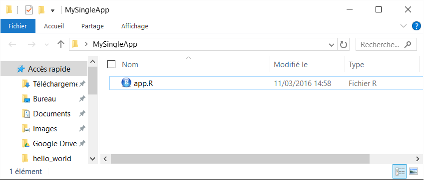
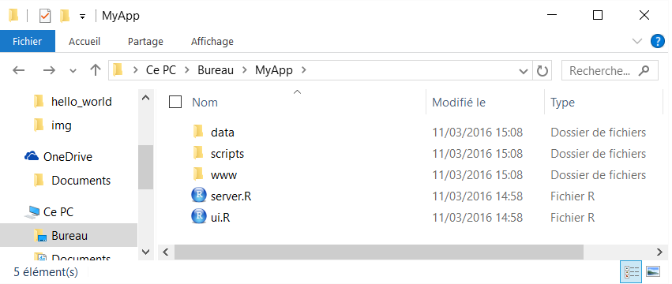

# Structure d'une application

## Structure d'une application | Un dossier avec un seul fichier

**conventions :**

- enregistré sous le nom __app.R__
- se terminant par la commande shinyApp()
- pour les **applications légères**

<div style="text-align:center" markdown="1">

</div>

## Structure d'une application | Un dossier avec un seul fichier

```{r, eval = FALSE}
library(shiny)
ui <- fluidPage(
  sliderInput(inputId = "num", label = "Choose a number", 
              value = 25, min = 1, max = 100),  
  plotOutput("hist")
)
server <- function(input, output) {  
  output$hist <- renderPlot({
    hist(rnorm(input$num))  
  }) 
}
shinyApp(ui = ui, server = server)
```

## Structure d'une application | Un dossier avec deux fichiers

**conventions :**

- côté interface utilisateur dans le script __ui.R__
- côté serveur dans le script __server.R__
- structure à **priviliégier**

<div style="text-align:center" markdown="1">

</div>

## Structure d'une application | Un dossier avec deux fichiers

__ui.R__
```{r, eval = FALSE}
library(shiny)
fluidPage(
  sliderInput(inputId = "num", label = "Choose a number", 
              value = 25, min = 1, max = 100),  
  plotOutput("hist")
)
```

__server.R__
```{r, eval = FALSE}
library(shiny)
function(input, output) {  
  output$hist <- renderPlot({hist(rnorm(input$num))}) 
}
```


## Structure d'une application | données/fichiers complémentaires

- le code __R__ tourne au niveau des scripts __R__, et peut donc accéder de façon relative à tous les objets présents dans le dossier de l'application
- l'application web, comme de convention, accède à tous les éléments présents dans le dossier ``www`` (css, images, javascript, documentation, ...)

<div style="text-align:center" markdown="1">

</div>
