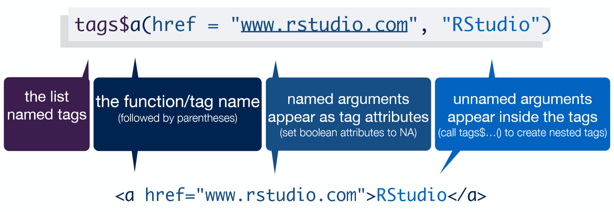

# Pour aller plus loin : HTML / CSS

## HTML / CSS | __Inclure du HTML__

De nombreuses balises __html__ sont disponibles avec les fonctions ``tags`` :

```{r, echo = FALSE}
names(tags)
```

-----

<div style="text-align:center" markdown="1">

</div>

C'est également possible de passer du code __HTML__ directement en utilisant la fonction du même nom :

```{r, eval = FALSE}
fluidPage(
  HTML("<h1>My Shiny App</h1>") 
)
```

## HTML / CSS | __Quelques balises utiles__

- ``div(..., align = "center")`` : centrer les éléments
- ``br()`` : saut de ligne
- ``hr()`` : trait horizontal
- ``img(src="img/logo.jpg", title="Popup", width = "80%")`` : insertion d'une image présente dans **www/img**
- ``a(href="https://r2018-rennes.sciencesconf.org/", target="_blank", "Rencontres R")`` : lien vers un site
- ``a(href = './doc/guide.pdf', target="_blank", class = "btn", icon("download"), 'Télécharger  le guide utilisateur')`` : lien de téléchargement d'un document présent dans **www/doc**

## HTML / CSS | CSS : introduction

__Shiny__ utilise [Bootstrap](http://getbootstrap.com/) pour la partie __CSS__.

Comme dans du développement web "classique", nous pouvons modifier le __CSS__ de trois façons :

- en faisant un lien vers un fichier .css externe, en ajoutant des feuilles de style dans le répertoire ``www``
- en ajoutant du __CSS__ dans le header __HTML__
- en écrivant individuellement du CSS aux éléments.

Il y a une notion d'ordre et de priorité sur ces trois informations : le __CSS__ "individuel" l'emporte sur le __CSS__ du header, qui l'emporte sur le __CSS__ externe

On peut aussi utiliser le package [shinythemes](http://rstudio.github.io/shinythemes)

## HTML / CSS  | Avec un .css externe

On peut par exemple aller prendre un thème sur [bootswatch](http://bootswatch.com/).

- Deux façons pour le renseigner : 
    + argument ``theme`` dans ``fluidPage``
    + ou avec un tags html : ``tags$head`` et ``tags$link``

```{r, eval = FALSE}
library(shiny)
ui <- fluidPage(theme = "mytheme.css",
  # ou avec un tags
  tags$head(
    tags$link(rel = "stylesheet", type = "text/css", href = "mytheme.css")
  ),
  # reste de l'application
)
```

----

```{r, echo = FALSE}
shinyAppDir(appDir = "shinyApps/customCSS/cssfile")
```


## HTML / CSS  | Ajout de css dans le header

- Le __CSS__ inclut dans le header sera prioritaire au __CSS__ externe
- inclusion avec les tags html : ``tags$head`` et ``tags$style``

```{r, eval = FALSE}
library(shiny)
  tags$head(
    tags$style(HTML("h1 { color: #48ca3b;}")
    )
  ),
  # reste de l'application
)
```

----

```{r, echo = FALSE}
shinyAppDir(appDir = "shinyApps/customCSS/cssheader")
```


## HTML / CSS  | CSS sur un élément

Pour finir, on peut également passer directement du __CSS__ aux éléments __HTML__ :

```{r, eval = FALSE}
library(shiny)
  h1("Mon titre", style = "color: #48ca3b;")
  # reste de l'application
)
```

----

```{r, echo = FALSE}
shinyAppDir(appDir = "shinyApps/customCSS/csselement")
```