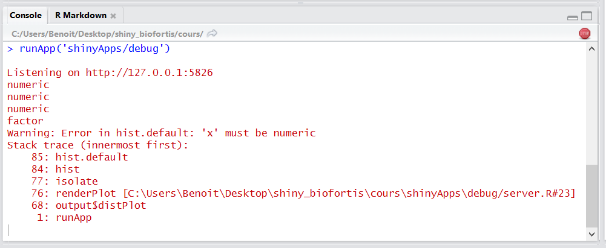
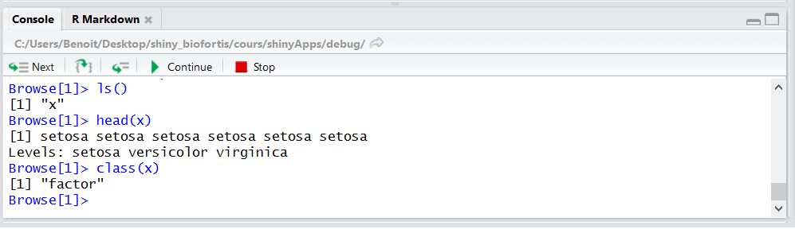
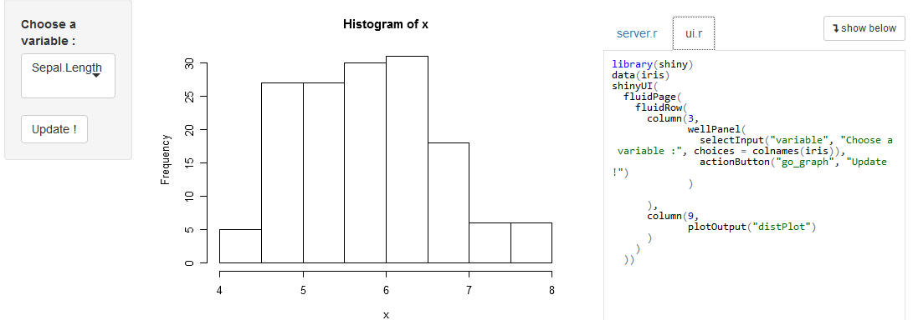
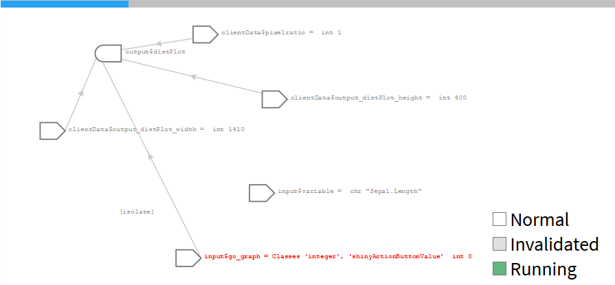
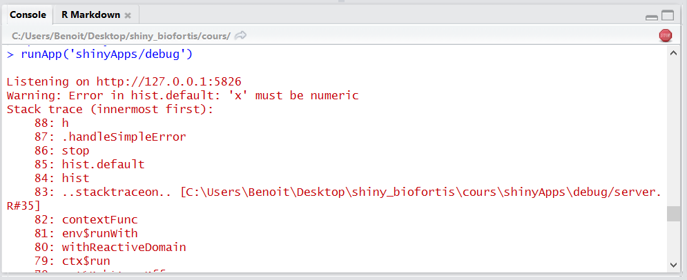

# Pour aller plus loin : débogage

## Débogage | Affichage console

- Un des premiers niveaux de débogage est l'utilisation de ``print`` console au-sein de l'application shiny.
- Cela permet d'afficher des informations lors du développement et/ou de l'éxécution de l'application
- Dans __shiny__, on utilisera de préférence ``cat(file=stderr(), ...)`` pour être sûr que l'affichage marche dans tous les cas d'outputs, et également dans les logs avec __shiny-server__

```{r, eval = FALSE}
 output$distPlot <- renderPlot({
  x <- iris[, input$variable]
  cat(file=stderr(), class(x)) # affichage de la classe de x
  hist(x)
})
```

## Débogage | Affichage console

<div style="text-align:center" markdown="1">

</div>

## Débogage | Lancement manuel d'un browser

- On peut insérer le lancement d'un ``browser()`` à n'importe quel moment
- On pourra alors observer les différents objets et avancer pas-à-pas 

```{r, eval = FALSE}
 output$distPlot <- renderPlot({
  x <- iris[, input$variable]
  browser() # lancement du browser
  hist(x)
})
```

- Ne pas oublier de l'enlever une fois le développement terminé...!


## Débogage | Lancement manuel d'un browser

<div style="text-align:center" markdown="1">

</div>

## Débogage | Lancement automatique d'un browser

- L'option ``options(shiny.error = browser)`` permet de lancer un ``browser()`` automatiquement lors de l'apparition d'une erreur

```{r, eval = FALSE}
options(shiny.error = browser)
```

## Débogage | Mode "showcase"

- En lançant une application avec l'option  ``display.mode="showcase"`` et l'utilisation de la fonction ``runApp()``, 
on peut observer en direct l'éxécution du code :

```{r, eval = FALSE}
runApp("path/to/myapp", display.mode="showcase")
```


## Débogage | Mode "showcase"

<div style="text-align:center" markdown="1">

</div>

## Débogage | Reactive log

- En activant l'option ``shiny.reactlog``, on peut visualiser à tous instants les dépendances et les flux entre les objets réactifs de __shiny__
    + soit en tappant ``ctrl+F3`` dans le navigateur web
    + soit en insérant ``showReactLog()`` au-sein du code shiny

```{r, eval = FALSE}
options(shiny.reactlog=TRUE) 

output$distPlot <- renderPlot({
  x <- iris[, input$variable]
  showReactLog() # launch shiny.reactlog
  hist(x)
}) 
```

## Débogage | Reactive log

<div style="text-align:center" markdown="1">

</div>

## Débogage | Communication client/server

- Toutes les communications entre le client et le server sont visibles en utilisant l'option ``shiny.trace``

```{r, eval = FALSE}
options(shiny.trace = TRUE) 
```


## Débogage | Communication client/server

<div style="text-align:center" markdown="1">

</div>

## Débogage | Traçage des erreurs

- Depuis ``shiny_0.13.1``, on récupère la stack trace quand une erreur se produit
- Si besoin, on peut récupérer une stack trace encore plus complète, comprenant les diffénrets fonctions internes, avec ``options(shiny.fullstacktrace = TRUE)``


```{r, eval = FALSE}
options(shiny.fullstacktrace = TRUE)
```


## Débogage | Traçage des erreurs

<div style="text-align:center" markdown="1">

</div>