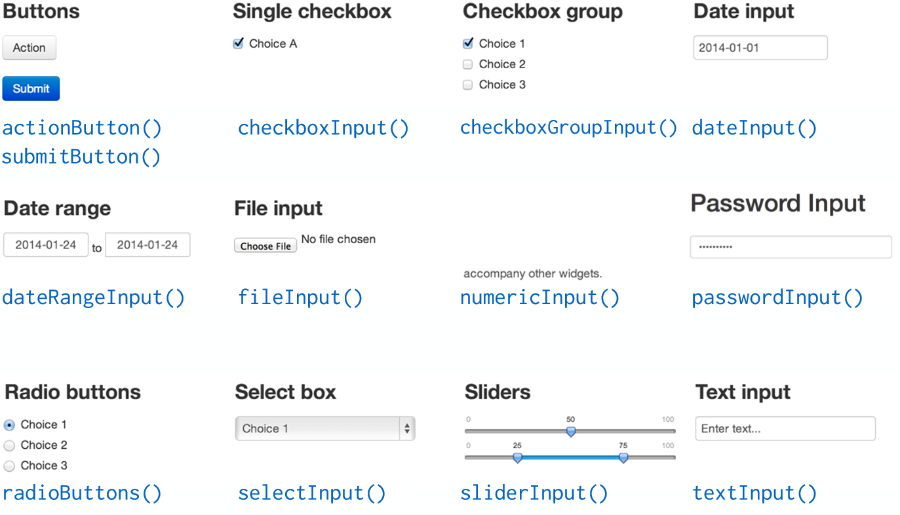

# Inputs

## Inputs | Vue globale

<div style="text-align:center" markdown="1">

</div>

## Inputs | Valeur numérique

- La fonction: 
```{r, echo = TRUE, eval = FALSE}
numericInput(inputId, label, value, min = NA, max = NA, step = NA)

```
- Exemple:
```{r, echo = TRUE, eval = FALSE}
numericInput(inputId = "id_num", label = "Please select a number", 
             value = 0, min = 0, max = 100, step = 10)
```

```{r, echo = FALSE}
shinyApp(
  ui = fluidPage(
    sidebarLayout(
      sidebarPanel(
        numericInput(inputId = "id_num", label = "Please select a number", 
                     value = 0, min = 0, max = 100, step = 10)
      ),
      mainPanel(
        fluidRow(column(2, h3("Value: ")),
                 column(3, h3(verbatimTextOutput("val_num")))
        ),
        fluidRow(column(2, h3("Class: ")),
                 column(3, h3(verbatimTextOutput("class_num")))
        )
      )
    )
  ), 
  server = function(input, output) {
    output$val_num <- renderPrint(input$id_num)
    output$class_num <- renderText(class(input$id_num))
  }
)
```

## Inputs | Chaîne de caractères

- La fonction: 
```{r, echo = TRUE, eval = FALSE}
textInput(inputId, label, value = "")

```
- Exemple:
```{r, echo = TRUE, eval = FALSE}
textInput(inputId = "id_txt", label = "Enter a text", value = "")
```

```{r, echo = FALSE}
shinyApp(
  ui = fluidPage(
    sidebarLayout(
      sidebarPanel(textInput(inputId = "id_txt", label = "Enter a text", value = "")),
      mainPanel(
        fluidRow(column(2, h3("Value: ")),
                 column(3, h3(verbatimTextOutput("val_txt")))
        ),
        fluidRow(column(2, h3("Class: ")),
                 column(3, h3(verbatimTextOutput("class_txt")))
        )
      )
    )
  ), 
  server = function(input, output) {
    output$val_txt <- renderPrint(input$id_txt)
    output$class_txt <- renderText(class(input$id_txt))
  }
)
```

## Inputs | Choix unique dans une liste

- La fonction: 
```{r, echo = TRUE, eval = FALSE}
selectInput(inputId, label, choices, selected = NULL, multiple = FALSE,
            selectize = TRUE, width = NULL, size = NULL)
```
- Exemple:
```{r, echo = TRUE, eval = FALSE}
selectizeInput(inputId = "id_sel1", label = "Select among the list: ", selected = 3,
               choices = c(1:3))
```

```{r, echo = FALSE}
shinyApp(
  ui = fluidPage(
    sidebarLayout(
      sidebarPanel(
        selectizeInput(inputId = "id_sel1", label = "Select among the list: ",
                       choices = c(1:3),
                       selected = 3)
      ),
      mainPanel(
        fluidRow(column(2, h3("Value: ")),
                 column(3, h3(verbatimTextOutput("val_sel1")))
        ),
        fluidRow(column(2, h3("Class: ")),
                 column(3, h3(verbatimTextOutput("class_sel1")))
        )
      )
    )
  ), 
  server = function(input, output) {
    output$val_sel1 <- renderPrint(input$id_sel1)
    output$class_sel1 <- renderText(class(input$id_sel1))
  }
)
```

## Inputs | Choix multiples dans une liste

- La fonction: 
```{r, echo = TRUE, eval = FALSE}
selectInput(inputId, label, choices, selected = NULL, multiple = FALSE,
            selectize = TRUE, width = NULL, size = NULL)
```
- Exemple:
```{r, echo = TRUE, eval = FALSE}
selectInput(inputId = "id_sel2", label = "Select among the list: ", selected = 3,
            choices = c("First" = 1, "Second" = 2, "Third" = 3), multiple = TRUE)
```

```{r, echo = FALSE, eval = TRUE}
shinyApp(ui = fluidPage(
  sidebarLayout(
    sidebarPanel(
      selectInput(inputId = "id_sel2", label = "Select among the list: ", 
                  choices = c("First" = 1, "Second" = 2, "Third" = 3),
                  selected = 3, multiple = TRUE)
    ),
    mainPanel(
      fluidRow(column(2, h3("Value: ")),
               column(3, h3(verbatimTextOutput("val_sel2")))
      ),
      fluidRow(column(2, h3("Class: ")),
               column(3, h3(verbatimTextOutput("class_sel2")))
      )
    )
  )
), 
server = function(input, output) {
  output$val_sel2 <- renderPrint(input$id_sel2)
  
  output$class_sel2 <- renderText(class(input$id_sel2))
})
```

## Inputs | Simple Checkbox

- La fonction: 
```{r, echo = TRUE, eval = FALSE}
checkboxInput(inputId, label, value = FALSE)

```
- Exemple:
```{r, echo = TRUE, eval = FALSE}
checkboxInput(inputId = "id_check_1", label = "Check ?")
```

```{r, echo = FALSE, eval = TRUE}
shinyApp(ui = fluidPage(
  sidebarLayout(
    sidebarPanel(
      h5("checkboxInput"),
      checkboxInput(inputId = "id_check_1", label = "Check ?", value = FALSE)
    ),
    mainPanel(
      fluidRow(column(2, h3("Value: ")),
               column(3, h3(verbatimTextOutput("val_check_1")))
      ),
      fluidRow(column(2, h3("Class: ")),
               column(3, h3(verbatimTextOutput("class_check_1")))
      )
    )
  )
), 
server = function(input, output) {
  output$val_check_1 <- renderPrint(input$id_check_1)
  output$class_check_1 <- renderText(class(input$id_check_1))
})
```

## Inputs | Checkboxes multiple 

- La fonction: 
```{r, echo = TRUE, eval = FALSE}
checkboxGroupInput(inputId, label, choices, selected = NULL, inline = FALSE)

```
- Exemple:
```{r, echo = TRUE, eval = FALSE}
checkboxGroupInput(inputId = "id_check_2", label = "Please select", selected = 3,
                   choices = c("First" = 1, "Second" = 2, "Third" = 3))
```

```{r, echo = FALSE, eval = TRUE}
shinyApp(ui = fluidPage(
  sidebarLayout(
    sidebarPanel(
      checkboxGroupInput(inputId = "id_check_2", label = "Please select", 
                         choices = c("First" = 1, "Second" = 2,
                                     "Third" = 3), 
                         selected = 3)
    ),
    mainPanel(
      fluidRow(column(2, h3("Value: ")),
               column(3, h3(verbatimTextOutput("val_check_2")))
      ),
      fluidRow(column(2, h3("Class: ")),
               column(3, h3(verbatimTextOutput("class_check_2")))
      )
    )
  )
), 
server = function(input, output) {
  output$val_check_2 <- renderPrint(input$id_check_2)
  output$class_check_2 <- renderText(class(input$id_check_2))
}
# , options = list(height = "20%")
)
```

## Inputs | Radio boutons

- La fonction: 
```{r, echo = TRUE, eval = FALSE}
radioButtons(inputId, label, choices, selected = NULL, inline = FALSE)

```
- Exemple:
```{r, echo = TRUE, eval = FALSE}
radioButtons(inputId = "id_radio", label = "Select one", 
             choices = c("First" = 1, "Second" = 2, "Third" = 3), 
             selected = 3)
```

```{r, echo = FALSE, eval = TRUE}
shinyApp(ui = fluidPage(
  sidebarLayout(
    sidebarPanel(
      radioButtons(inputId = "id_radio", label = "Select one", 
                   choices = c("First" = 1, "Second" = 2, "Third" = 3), 
                   selected = 3)
    ),
    mainPanel(
      fluidRow(column(2, h3("Value: ")),
               column(3, h3(verbatimTextOutput("val_radio")))
      ),
      fluidRow(column(2, h3("Class: ")),
               column(3, h3(verbatimTextOutput("class_radio")))
      )
    )
  )
), 
server = function(input, output) {
  output$val_radio <- renderPrint(input$id_radio)
  output$class_radio <- renderText(class(input$id_radio))
})
```

## Inputs | Date | _Code_

- La fonction: 
```{r, echo = TRUE, eval = FALSE}
dateInput(inputId, label, value = NULL, min = NULL, max = NULL, format = "yyyy-mm-dd", 
          startview = "month", weekstart = 0, language = "en")

```
- Exemple:
```{r, echo = TRUE, eval = FALSE}
dateInput(inputId = "id_date", label = "Please enter a date", value = "12/08/2015",
          format = "dd/mm/yyyy", startview = "month", weekstart = 0, language = "fr")
```

## Inputs | Date | _App_


```{r, echo = FALSE, eval = TRUE}
shinyApp(
  ui = fluidPage(
    sidebarLayout(
      sidebarPanel(
        dateInput(inputId = "id_date", label = "Please enter a date",
                  value = "12/08/2015", weekstart = 0, language = "fr",
                  min = NULL, max = NULL, format = "dd/mm/yyyy", startview = "month")
      ),
      mainPanel(
        fluidRow(column(3, h3("Value: ")),
                 column(5, h3(verbatimTextOutput("val_date")))
        ),
        fluidRow(column(3, h3("Class: ")),
                 column(5, h3(verbatimTextOutput("class_date")))
        )
      )
    )
  ), 
  server = function(input, output) {
    output$val_date <- renderPrint(input$id_date)
    output$class_date <- renderText(class(input$id_date))
  }
)
```

## Inputs | Période | _Code_

- La fonction: 
```{r, echo = TRUE, eval = FALSE}
dateRangeInput(inputId, label, start = NULL, end = NULL, min = NULL, max = NULL,
               format = "yyyy-mm-dd", startview = "month", weekstart = 0,
               language = "en", separator = " to ")

```
- Exemple:

```{r, echo = TRUE, eval = FALSE}
dateRangeInput(inputId = "id_daterange", label = "Please Select a date range",
               start = "2015-01-01", end = "2015-08-12", format = "yyyy-mm-dd",
               language = "en", separator = " to ")
```

## Inputs | Période | _App_

```{r, echo = FALSE}
shinyApp(
  ui = fluidPage(
    sidebarLayout(
      sidebarPanel(
        dateRangeInput(inputId = "id_daterange", label = "Please Select a date range", 
                       start = "2015-01-01", end = "2015-08-12", 
                       min = NULL, max = NULL, format = "yyyy-mm-dd", 
                       language = "en", separator = " to ")
      ),
      mainPanel(
        fluidRow(column(3, h3("Value: ")),
                 column(8, h3(verbatimTextOutput("val_daterange")))
        ),
        fluidRow(column(3, h3("Class: ")),
                 column(8, h3(verbatimTextOutput("class_daterange")))
        )
      )
    )
  ), 
  server = function(input, output) {
    output$val_daterange <- renderPrint(input$id_daterange)
    output$class_daterange <- renderText(class(input$id_daterange))
  }
)
```

## Inputs | Slider numérique : valeur unique

- La fonction: 
```{r, echo = TRUE, eval = FALSE}
sliderInput(inputId, label, min, max, value, step = NULL, round = FALSE,
            format = NULL, locale = NULL, ticks = TRUE, animate = FALSE,
            width = NULL, sep = ",", pre = NULL, post = NULL)


```
- Exemple:
```{r, echo = TRUE, eval = FALSE}
sliderInput(inputId = "id_slider", label = "Select a number", min = 0, max = 10, 
            value = 5, step = 1)

```

```{r, echo = FALSE, eval = TRUE}
shinyApp(
  ui = fluidPage(
    sidebarLayout(
      sidebarPanel(
        sliderInput(inputId = "id_slider", label = "Select a number", min = 0, max = 10, 
                    value = 5, step = 1, round = FALSE)
      ),
      mainPanel(
        fluidRow(column(2, h3("Value: ")),
                 column(3, h3(verbatimTextOutput("val_slider")))
        ),
        fluidRow(column(2, h3("Class: ")),
                 column(3, h3(verbatimTextOutput("class_slider")))
        )
      )
    )
  ), 
  server = function(input, output) {
    output$val_slider <- renderPrint(input$id_slider)
    output$class_slider <- renderText(class(input$id_slider))
  }
)
```

## Inputs | Slider numérique : range

- La fonction: 
```{r, echo = TRUE, eval = FALSE}
sliderInput(inputId, label, min, max, value, step = NULL, round = FALSE,
            format = NULL, locale = NULL, ticks = TRUE, animate = FALSE,
            width = NULL, sep = ",", pre = NULL, post = NULL)


```
- Exemple:
```{r, echo = TRUE, eval = FALSE}
sliderInput(inputId = "id_slider2", label = "Select a number", min = 0, max = 10, 
            value = c(2,7), step = 1)

```

```{r, echo = FALSE}
shinyApp(
  ui = fluidPage(
    sidebarLayout(
      sidebarPanel(
        sliderInput(inputId = "id_slider2", label = "Select a number", min = 0, max = 10, 
                    value = c(2,7), step = 1)
      ),
      mainPanel(
        fluidRow(column(2, h3("Value: ")),
                 column(3, h3(verbatimTextOutput("val_slider2")))
        ),
        fluidRow(column(2, h3("Class: ")),
                 column(3, h3(verbatimTextOutput("class_slider2")))
        )
      )
    )
  ), 
  server = function(input, output) {
    output$val_slider2 <- renderPrint(input$id_slider2)
    output$class_slider2 <- renderText(class(input$id_slider2))
  }
)
```

## Inputs | Importer un fichier

- La fonction: 
```{r, echo = TRUE, eval = FALSE}
fileInput(inputId, label, multiple = FALSE, accept = NULL)
```
- Exemple:
```{r, echo = TRUE, eval = FALSE}
fileInput(inputId = "id_file", label = "Select a file")
```

```{r, echo = FALSE}
shinyApp(
  ui = fluidPage(
    sidebarLayout(
      sidebarPanel(
        fileInput(inputId = "id_file", label = "Select a file")
      ),
      mainPanel(
        h3("Value: "),
        h3(tableOutput("val_file")),
        fluidRow(
          column(3, h3("Class: ")),
          column(3, h3(verbatimTextOutput("class_file")))
        )
      )
    )
  ), 
  server = function(input, output) {
    output$val_file <- renderTable(input$id_file)
    output$class_file <- renderText(class(input$id_file))
  }
)
```

## Inputs | Bouton Action

- La fonction: 
```{r, echo = TRUE, eval = FALSE}
actionButton(inputId, label, icon = NULL, ...)

```
- Exemple:
```{r, echo = TRUE, eval = FALSE}
actionButton(inputId = "id_action", label = "Click !", 
             icon = icon("hand-spock-o"))
```

```{r, echo = FALSE, eval = TRUE}
shinyApp(ui = fluidPage(
  sidebarLayout(
    sidebarPanel(
      h5("Action button"),
      actionButton(inputId = "id_action", label = "Click !", icon = icon("space-shuttle"))
    ),
    mainPanel(
      fluidRow(column(3, h3("Value: ")),
               column(3, h3(verbatimTextOutput("val_action")))
      ),
      fluidRow(column(3, h3("Class: ")),
               column(3, h3(verbatimTextOutput("class_action")))
      )
    )
  )
), 
server = function(input, output) {
  output$val_action <- renderPrint(as.numeric(input$id_action))
  output$class_action <- renderText(class(input$id_action)[1])
}
# , options = list(height = "20%")
)
```

## Inputs | Aller plus loin : construire son propre input

__Avec un peu de compétences en HTML/CSS/JavaScript, il est également possible de construire des inputs personnalisés__

Un tutoriel est disponible : [http://shiny.rstudio.com/articles/building-inputs.html](http://shiny.rstudio.com/articles/building-inputs.html)

Ainsi que deux applications d'exemples : 

- [http://shiny.rstudio.com/gallery/custom-input-control.html](http://shiny.rstudio.com/gallery/custom-input-control.html)

- [http://shiny.rstudio.com/gallery/custom-input-bindings.html](http://shiny.rstudio.com/gallery/custom-input-bindings.html)