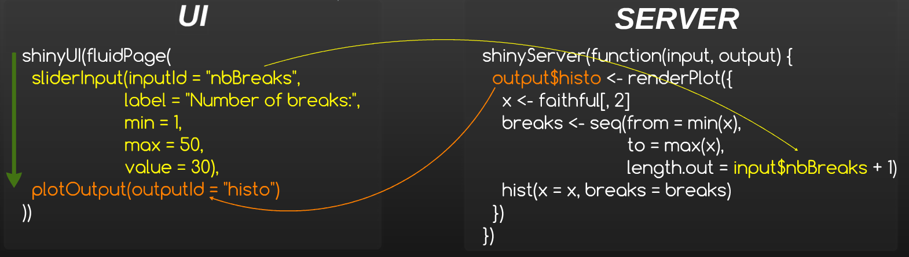
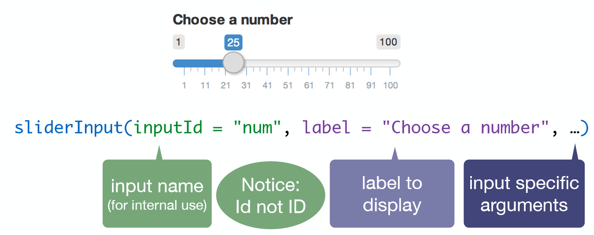
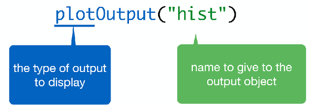
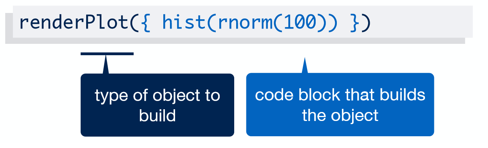

# Intéractivité et communication

## Intéractivité et communication | Introduction | App

```{r, echo = FALSE}
shinyApp(
  ui = fluidPage(
    titlePanel("Hello Shiny!"),
    sidebarLayout(
      sidebarPanel(
        sliderInput("bins",
                    "Number of bins:",
                    min = 1,
                    max = 50,
                    value = 30)
      ),
      mainPanel(
        plotOutput("distPlot")
      )
    )
  ), 
  
  server = function(input, output) {
    
    # Expression that generates a histogram. The expression is
    # wrapped in a call to renderPlot to indicate that:
    #
    #  1) It is "reactive" and therefore should be automatically
    #     re-executed when inputs change
    #  2) Its output type is a plot
    
    output$distPlot <- renderPlot({
      x    <- faithful[, 2]  # Old Faithful Geyser data
      bins <- seq(min(x), max(x), length.out = input$bins + 1)
      # draw the histogram with the specified number of bins
      hist(x, breaks = bins, col = 'darkgray', border = 'white')
    })
  })

```

## Intéractivité et communication | Introduction | process

<div style="text-align:center" markdown="1">

</div>

__Le server et l'ui communiquent uniquement par le biais des inputs et des outputs__

__Par défaut, un output est mis-à-jour chaque fois qu'un input en lien change__

## Intéractivité et communication | Notice

__la définition de l'interface utilisateur : UI__

- la déclaration des inputs
- la structure de la page, avec le placement des outputs

__la partie serveur/calculs : SERVER__

- la déclaration et le calcul des outputs

## Intéractivité et communication | UI

__Deux types d'éléments dans le UI__

- xxInput(inputId = ..., ...):

    * définit un élément qui permet une action de l'utilisateur
    * accessible côté serveur avec son identifiant __input$inputID__

<div style="text-align:center" markdown="1">

</div>

## Intéractivité et communication | UI

- xxOutput(ouputId = ...):

    * fait référence à un output créé et défini côté serveur
    * en général : graphiques et tableaux

<div style="text-align:center" markdown="1">

</div>

## Intéractivité et communication | Serveur

__Définition des outputs dans le serveur__

- renderXX({expr}):

    * calcule et retourne une sortie, dépendante d'inputs, via une expression __R__

<div style="text-align:center" markdown="1">

</div>

## Intéractivité et communication | Retour sur le process

<div style="text-align:center" markdown="1">

</div>

__C'est plus clair ?__

## Intéractivité et communication | Partage ui <-> server

__Le server et l'ui communiquent uniquement par le biais des inputs et des outputs__

- Nous pouvons ajouter un script nommé **global.R** pour partager des éléments (variables,  packages, ...) entre la partie __UI__ et la partie __SERVER__ 

- Tout ce qui est présent dans le **global.R** est visible à la fois dans le __ui.R__ et dans le __server.R__

- Le script **global.R** est chargé uniquement une seul fois au lancement de l'application

- Dans le cas d'une utilisation avec un ``shiny-server``, les objets globaux sont également partagés entre les utilisateurs