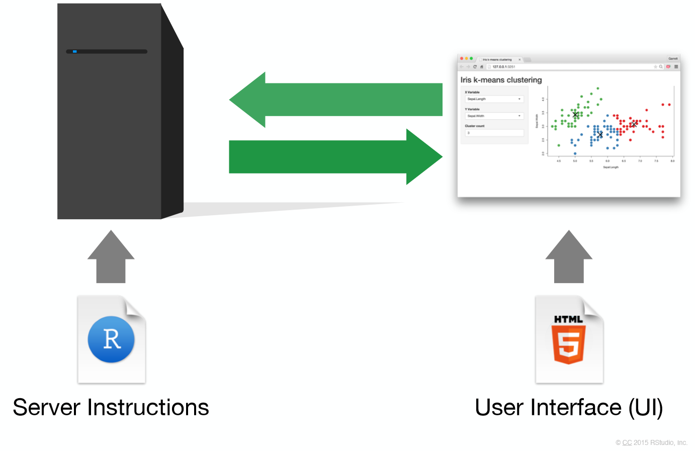
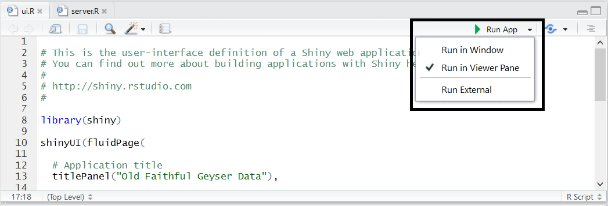
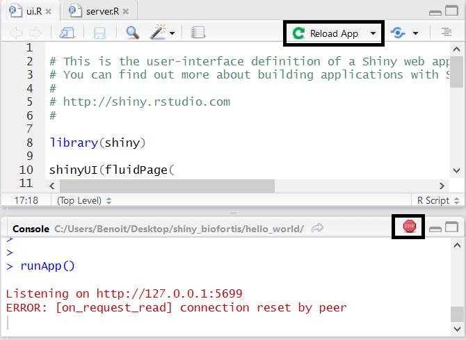

## Summary

1. Introduction
2. Structure d'une application
3. Intéractivité et communication
4. Inputs & outputs
5. Structurer sa page
6. Graphiques intéractifs
7. HTML / CSS
8. Pour aller plus loin

## Shiny : créer des applications web avec le logiciel R

__Shiny__ est un package __R__ qui permet la création simple d'applications web intéractives depuis le logiciel open-source __R__.

- pas de connaissances _web_ nécessaires
- le pouvoir de calcul de R et l'intéractivité du web actuel
- pour créer des applications locales
- ou partagées avec l'utilisation de __shiny-server__, __shinyapps.io__, __shinyproxy__

<http://shiny.rstudio.com>

<http://www.shinyapps.io/>

<https://www.shinyproxy.io/>

<https://www.rstudio.com/products/shiny/shiny-server/>.

----

Une application __shiny__ nécessite un ordinateur/un serveur éxécutant __R__

<div style="text-align:center" markdown="1">

</div>

## Ma première application avec shiny

- Initialiser une application est simple avec __RStudio__, en créant un nouveau projet

    * File > New Project > New Directory > Shiny Web Application
    * Basée sur deux scripts : ui.R et server.R
    * Et utilisant par défaut le sidebar layout

- Commandes utiles :
    + lancement de l'application : bouton __Run app__
    + actualisatisation : bouton __Reload app__
    + arrêt : bouton __Stop__


----

<div style="text-align:center" markdown="1">

</div>

- __Run in Window__ : Nouvelle fenêtre, utilisant l'environnement __RStudio__
- __Run in Viewer Pane__ : Dans l'onglet _Viewer_ de __RStudio__
- __Run External__ : Dans le navigateur web par défaut

----

<div style="text-align:center" markdown="1">

</div>

```{r child = 'application.Rmd'}
```

```{r child = 'interactivity.Rmd'}
```

```{r child = 'input.Rmd'}
```

```{r child = 'output.Rmd'}
```

```{r child = 'ui_structure.Rmd'}
```

```{r child = 'htmlwidgets.Rmd'}
```

```{r child = 'isolation.Rmd'}
```

```{r child = 'reactive.Rmd'}
```

```{r child = 'conditionnal.Rmd'}
```

```{r child = 'observe_update.Rmd'}
```

```{r child = 'css.Rmd'}
```

# Pour aller plus loin : quelques bonnes pratiques

## Quelques bonnes pratiques

- Préférer l'underscore (_) au point (.) comme séparateur dans le nom des variables. En effet, le **.** peut amener de mauvaises intérations avec d'autres langages, comme le __JavaScript__
- Faire bien attention à __l'unicité des différents identifiants__ des inputs/outputs
- Pour éviter des problèmes éventuels avec __des versions différentes de packages__, et notamment dans le cas de __plusieurs applications shiny__ et/ou différents environnements de travail, essayer d'utiliser [packrat](https://rstudio.github.io/packrat/)
- Mettre toute la __partie "calcul"__ dans des __fonctions/un package__ et effectuer des tests ([testthat](http://r-pkgs.had.co.nz/tests.html))

## Quelques bonnes pratiques

- Diviser la partie __ui.R__ et __server.R__ en plusieurs scripts, un par onglet par exemple :

```{r, echo = TRUE, eval = FALSE}
# ui.R
shinyUI(
  navbarPage("Divide UI & SERVER",
    source("src/ui/01_ui_plot.R", local = TRUE)$value,
    source("src/ui/02_ui_data.R", local = TRUE)$value
  )
)
# server.R
shinyServer(function(input, output, session) {
  source("src/server/01_server_plot.R", local = TRUE)
  source("src/server/02_server_data.R", local = TRUE)
})
```

```{r child = 'debug.Rmd'}
```


# Références

## Références / Tutoriaux / Exemples

* http://shiny.rstudio.com/
* http://shiny.rstudio.com/articles/
* http://shiny.rstudio.com/tutorial/
* http://shiny.rstudio.com/gallery/
* https://www.rstudio.com/products/shiny/shiny-user-showcase/
* http://www.showmeshiny.com/


