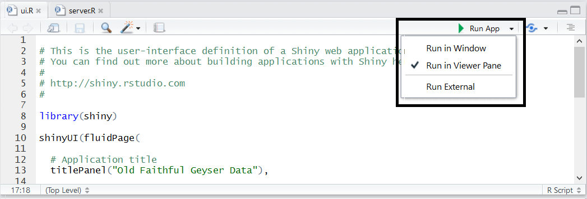
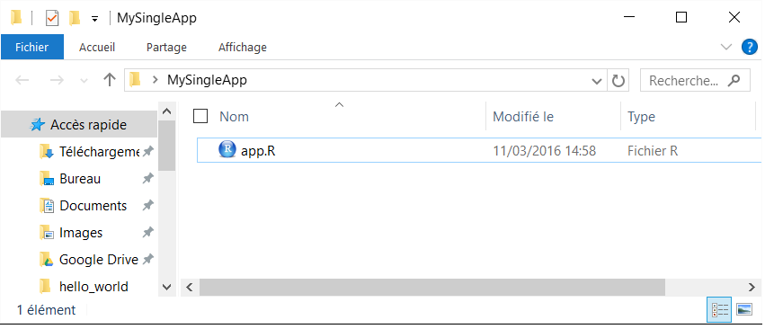
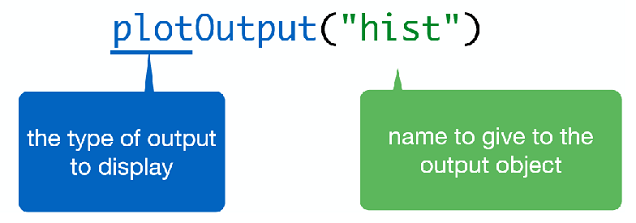
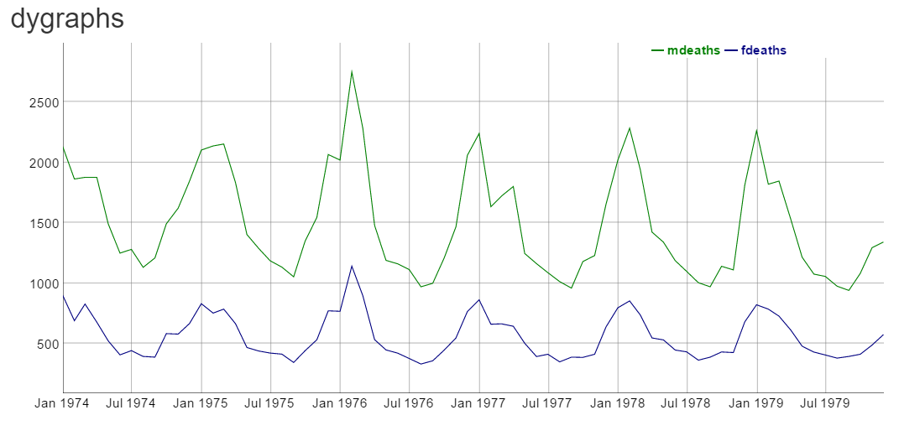
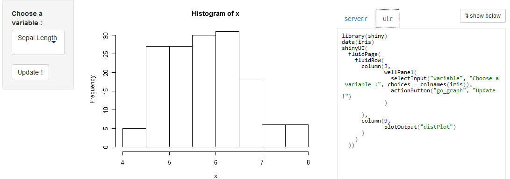
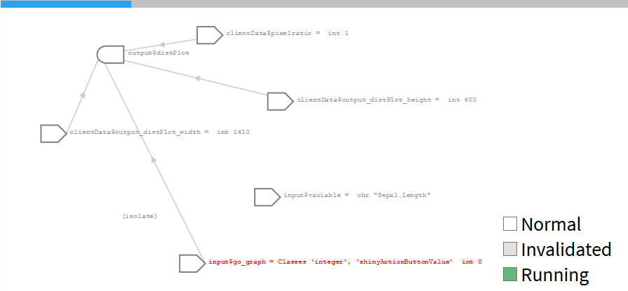
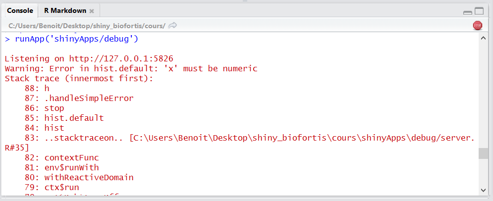

# Shiny : créer des applications web avec le logiciel R

__Shiny__ est un package __R__ qui permet la création simple d'applications web intéractives depuis le logiciel open-source __R__.

- pas de connaissances _web_ nécessaires
- le pouvoir de calcul de R et l'intéractivité du web actuel
- pour créer des applications locales
- ou partagées avec l'utilisation de __shiny-server__, __shinyapps.io__, __shinyproxy__

<http://shiny.rstudio.com>

<http://www.shinyapps.io/>

<https://www.shinyproxy.io/>

<https://www.rstudio.com/products/shiny/shiny-server/>

Une application __shiny__ nécessite un ordinateur/un serveur éxécutant __R__


# Ma première application avec shiny

- Initialiser une application est simple avec __RStudio__, en créant un nouveau projet

* File > New Project > New Directory > Shiny Web Application
* Basée sur deux scripts : ui.R et server.R
* Et utilisant par défaut le sidebar layout

- Commandes utiles :
+ lancement de l'application : bouton __Run app__
+ actualisatisation : bouton __Reload app__
+ arrêt : bouton __Stop__




- __Run in Window__ : Nouvelle fenêtre, utilisant l'environnement __RStudio__
- __Run in Viewer Pane__ : Dans l'onglet _Viewer_ de __RStudio__
- __Run External__ : Dans le navigateur web par défaut


# Structure d'une application

## Un dossier avec un seul fichier

**conventions :**

- enregistré sous le nom __app.R__
- se terminant par la commande shinyApp()
- pour les **applications légères**




```{r, eval = FALSE}
library(shiny)
ui <- fluidPage(
  sliderInput(inputId = "num", label = "Choose a number", 
              value = 25, min = 1, max = 100),  
  plotOutput("hist")
)
server <- function(input, output) {  
  output$hist <- renderPlot({
    hist(rnorm(input$num))  
  }) 
}
shinyApp(ui = ui, server = server)
```

## Un dossier avec deux fichiers

**conventions :**

- côté interface utilisateur dans le script __ui.R__
- côté serveur dans le script __server.R__
- structure à **priviliégier**


__ui.R__
```{r, eval = FALSE}
library(shiny)
fluidPage(
  sliderInput(inputId = "num", label = "Choose a number", 
              value = 25, min = 1, max = 100),  
  plotOutput("hist")
)
```

__server.R__
```{r, eval = FALSE}
library(shiny)
function(input, output) {  
  output$hist <- renderPlot({hist(rnorm(input$num))}) 
}
```


## Données/fichiers complémentaires

- le code __R__ tourne au niveau des scripts __R__, et peut donc accéder de façon relative à tous les objets présents dans le dossier de l'application
- l'application web, comme de convention, accède à tous les éléments présents dans le dossier ``www`` (css, images, javascript, documentation, ...)


# Intéractivité et communication

## Introduction

**ui.R**:

```{r, eval = FALSE}
library(shiny)

# Define UI for application that draws a histogram
shinyUI(fluidPage(
  # Application title
  titlePanel("Hello Shiny!"),
  # Sidebar with a slider input for the number of bins
  sidebarLayout(
    sidebarPanel(
      sliderInput(inputId = "bins", 
                  label = "Number of bins:",
                  min = 1, max = 50, value = 30)
    ),
    # Show a plot of the generated distribution
    mainPanel(plotOutput(outputId = "distPlot"))
  )
))
```

**server.R**:

```{r, eval = FALSE}
library(shiny)

# Define server logic required to draw a histogram
shinyServer(function(input, output) {
  # Expression that generates a histogram. The expression is
  # wrapped in a call to renderPlot to indicate that:
  #
  #  1) It is "reactive" and therefore should be automatically
  #     re-executed when inputs change
  #  2) Its output type is a plot
  output$distPlot <- renderPlot({
    x    <- faithful[, 2]  # Old Faithful Geyser data
    bins <- seq(min(x), max(x), length.out = input$bins + 1)
    # draw the histogram with the specified number of bins
    hist(x, breaks = bins, col = 'darkgray', border = 'white')
  })
})
```


Avec cette exemple simple, nous comprenons : 

- Côté **ui**, nous définissons un slider numérique avec le code "`sliderInput(inputId = "bins",...)`" et on utilise sa valeur côté **server** avec la notation "`input$bins`" :  c'est comme cela que le  **ui** créé des variables disponibles dans le **server** !

- Côété **server**,  nous créons un graphique "`output$distPlot <- renderPlot({...})`" et l'appelons dans le **ui** avec "`plotOutput(outputId = "distPlot")`", c'est comme cela que le **server** retourne des objet à **ui** !

## Process


__Le server et l'ui communiquent uniquement par le biais des inputs et des outputs__

__Par défaut, un output est mis-à-jour chaque fois qu'un input en lien change__

## Notice

__la définition de l'interface utilisateur : UI__

- la déclaration des inputs
- la structure de la page, avec le placement des outputs

__la partie serveur/calculs : SERVER__

- la déclaration et le calcul des outputs

## UI 

__Deux types d'éléments dans le UI__

- xxInput(inputId = ..., ...):

* définit un élément qui permet une action de l'utilisateur
* accessible côté serveur avec son identifiant __input$inputID__


- xxOutput(ouputId = ...):

* fait référence à un output créé et défini côté serveur
* en général : graphiques et tableaux



## Serveur

__Définition des outputs dans le serveur__

- renderXX({expr}):

* calcule et retourne une sortie, dépendante d'inputs, via une expression __R__


## Retour sur le process


__C'est plus clair ?__

## Partage ui <-> server

__Le server et l'ui communiquent uniquement par le biais des inputs et des outputs__

- Nous pouvons ajouter un script nommé **global.R** pour partager des éléments (variables,  packages, ...) entre la partie __UI__ et la partie __SERVER__ 

- Tout ce qui est présent dans le **global.R** est visible à la fois dans le __ui.R__ et dans le __server.R__

- Le script **global.R** est chargé uniquement une seul fois au lancement de l'application

- Dans le cas d'une utilisation avec un ``shiny-server``, les objets globaux sont également partagés entre les utilisateurs

# Les inputs

## Vue globale


## Valeur numérique

- La fonction

```{r, echo = TRUE, eval = FALSE}
numericInput(inputId, label, value, min = NA, max = NA, step = NA)
```

- Exemple:

```{r, echo = TRUE, eval = FALSE}
numericInput(inputId = "idNumeric", label = "Please select a number", 
             value = 0, min = 0, max = 100, step = 10)

# For the server input$idNumeric will be of class "numeric"
# ("integer" when the parameter step is an integer value)
```


## Chaîne de caractères

- La fonction 
```{r, echo = TRUE, eval = FALSE}
textInput(inputId, label, value = "")

```

- Exemple:
```{r, echo = TRUE, eval = FALSE}
textInput(inputId = "idText", label = "Enter a text", value = "")

# For the server input$idText will be of class "character" 
```


## Liste de sélection

- La fonction 

```{r, echo = TRUE, eval = FALSE}
selectInput(inputId, label, choices, selected = NULL, multiple = FALSE,
            selectize = TRUE, width = NULL, size = NULL)
```

- Exemple:

```{r, echo = TRUE, eval = FALSE}
selectInput(inputId = "idSelect", label = "Select among the list: ", selected = 3,
            choices = c("First" = 1, "Second" = 2, "Third" = 3))

# For the server input$idSelect is of class "character"
# (vector when the parameter "multiple" is TRUE)
```


## Checkbox

- La fonction

```{r, echo = TRUE, eval = FALSE}
checkboxInput(inputId, label, value = FALSE)
```

- Exemple:

```{r, echo = TRUE, eval = FALSE}
checkboxInput(inputId = "idCheck1", label = "Check ?")

# For the server input$idCheck1 is of class "logical"
```


## Checkboxes multiple 

- La fonction

```{r, echo = TRUE, eval = FALSE}
checkboxGroupInput(inputId, label, choices, selected = NULL, inline = FALSE)

```

- Exemple:

```{r, echo = TRUE, eval = FALSE}
checkboxGroupInput(inputId = "idCheckGroup", label = "Please select", selected = 3,
                   choices = c("First" = 1, "Second" = 2, "Third" = 3))

# For the server input$idCheckGroup is a "character" vector
```


## Radio boutons

- La fonction

```{r, echo = TRUE, eval = FALSE}
radioButtons(inputId, label, choices, selected = NULL, inline = FALSE)
```

- Exemple:

```{r, echo = TRUE, eval = FALSE}
radioButtons(inputId = "idRadio", label = "Select one", selected = 3,
             choices = c("First" = 1, "Second" = 2, "Third" = 3))

# For the server input$idRadio is a "character"
```


## Date

- La fonction

```{r, echo = TRUE, eval = FALSE}
dateInput(inputId, label, value = NULL, min = NULL, max = NULL, format = "yyyy-mm-dd", 
          startview = "month", weekstart = 0, language = "en")
```

- Exemple:

```{r, echo = TRUE, eval = FALSE}
dateInput(inputId = "idDate", label = "Please enter a date", value = "12/08/2015",
          format = "dd/mm/yyyy", startview = "month", weekstart = 0, language = "fr")

# For the server input$idDate is a "Date"
```


## Période

- La fonction

```{r, echo = TRUE, eval = FALSE}
dateRangeInput(inputId, label, start = NULL, end = NULL, min = NULL, max = NULL,
               format = "yyyy-mm-dd", startview = "month", weekstart = 0,
               language = "en", separator = " to ")
```

- Exemple:

```{r, echo = TRUE, eval = FALSE}
dateRangeInput(inputId = "idDateRange", label = "Please Select a date range",
               start = "2015-01-01", end = "2015-08-12", format = "yyyy-mm-dd",
               language = "en", separator = " to ")

# For the server input$idDateRange is a vector of class "Date" with two elements
```


## Slider numérique : valeur unique

- La fonction

```{r, echo = TRUE, eval = FALSE}
sliderInput(inputId, label, min, max, value, step = NULL, round = FALSE,
            format = NULL, locale = NULL, ticks = TRUE, animate = FALSE,
            width = NULL, sep = ",", pre = NULL, post = NULL)
```

- Exemple:

```{r, echo = TRUE, eval = FALSE}
sliderInput(inputId = "idSlider1", label = "Select a number", min = 0, max = 10, 
            value = 5, step = 1)

# For the server input$idSlider1 is a "numeric"
# (integer when the parameter "step" is an integer too)
```


## Slider numérique : range

- La fonction

```{r, echo = TRUE, eval = FALSE}
sliderInput(inputId, label, min, max, value, step = NULL, round = FALSE,
            format = NULL, locale = NULL, ticks = TRUE, animate = FALSE,
            width = NULL, sep = ",", pre = NULL, post = NULL)
```

- Exemple:

```{r, echo = TRUE, eval = FALSE}
sliderInput(inputId = "idSlider2", label = "Select a number", min = 0, max = 10, 
            value = c(2,7), step = 1)

# For the server input$idSlider2 is a "numeric" vector
# (integer when the parameter "step" is an integer too)
```


## Importer un fichier

- La fonction

```{r, echo = TRUE, eval = FALSE}
fileInput(inputId, label, multiple = FALSE, accept = NULL)
```

- Exemple:

```{r, echo = TRUE, eval = FALSE}
fileInput(inputId = "idFile", label = "Select a file")

# For the server input$idFile is a "data.frame" with four "character" columns
# (name, size, type and datapath) and one row
```


## Action Bouton

- La fonction

```{r, echo = TRUE, eval = FALSE}
actionButton(inputId, label, icon = NULL, ...)
```

- Exemple:

```{r, echo = TRUE, eval = FALSE}
actionButton(inputId = "idActionButton", label = "Click !", 
             icon = icon("hand-spock-o"))

# For the server input$idActionButton is an "integer"
```


## Aller plus loin : construire son propre input

__Avec un peu de compétences en HTML/CSS/JavaScript, il est également possible de construire des inputs personnalisés__

Un tutoriel est disponible : [http://shiny.rstudio.com/articles/building-inputs.html](http://shiny.rstudio.com/articles/building-inputs.html)

Ainsi que deux applications d'exemples : 

- [http://shiny.rstudio.com/gallery/custom-input-control.html](http://shiny.rstudio.com/gallery/custom-input-control.html)

- [http://shiny.rstudio.com/gallery/custom-input-bindings.html](http://shiny.rstudio.com/gallery/custom-input-bindings.html)

# Outputs

## Vue globale


## Les bonnes règles de construction

- assigner l'output à afficher dans la liste __output__, avec un nom permettant l'identification côté __UI__
- utiliser une fonction __renderXX({expr})__
- __la dernière expression doit correspondre au type d'objet retourné__
- accéder aux inputs, et amener la réactivité, en utilisant la liste __input__ et l'identifiant : __input$inputId__

```{r, echo = TRUE, eval = FALSE}
#ui.R
selectInput("lettre", "Lettres:", LETTERS[1:3])
verbatimTextOutput(outputId = "selection")
#server.R
output$selection <- renderPrint({input$lettre})
```

## Print

- __ui.r__:

```{r, echo = TRUE, eval = FALSE}
verbatimTextOutput(outputId = "texte")
```

- __server.r__:

```{r, echo = TRUE, eval = FALSE}
output$texte <- renderPrint({
  c("Hello shiny !")
})
```


## Text

- __ui.r__:

```{r, echo = TRUE, eval = FALSE}
textOutput(outputId = "texte")
```

- __server.r__:

```{r, echo = TRUE, eval = FALSE}
output$texte <- renderText({
  c("Hello shiny !")
})
```


### Plot

- __ui.r__: 

```{r, echo = TRUE, eval = FALSE}
plotOutput("myplot")
```

- __server.r__:

```{r, echo = TRUE, eval = FALSE}
output$myplot <- renderPlot({
  hist(iris$Sepal.Length)
})
```


## Table

- __ui.r__:

```{r, eval=FALSE}
tableOutput(outputId = "table")
```

- __server.r__:

```{r, eval=FALSE}
output$table <- renderTable({iris})
```


## DataTable

- __ui.r__:

```{r, eval=FALSE}
dataTableOutput(outputId = "dataTable")
```

- __server.r__:

```{r, eval=FALSE}
output$dataTable <- renderDataTable({
  iris
})
```


## Définir des élements de l'UI côté SERVER | Définition

__Dans certains cas, nous souhaitons définir des inputs ou des structures côté server__

Cela est possible avec les fonctions ``uiOutput`` et ``renderUI``

## Définir des élements de l'UI côté SERVER | Exemple simple

- __ui.r__: 
```{r, echo = TRUE, eval = FALSE}
uiOutput(outputId = "columns")
```
- __server.r__:
```{r, echo = TRUE, eval = FALSE}
output$columns <- renderUI({
  selectInput(inputId = "sel_col", label = "Column", choices = colnames(data))
})
```


## Définir des élements de l'UI côté SERVER | Exemple plus complexe

- __On peut également renvoyer un élément plus complexe de l'UI, par exemple :__
    * tout en ``layout``
    * ou une ``fluidRow``

- __ui.r__: 
```{r, echo = TRUE, eval = FALSE}
uiOutput(outputId = "fluidRow_ui")
```
- __server.r__:
```{r, echo = TRUE, eval = FALSE}
output$fluidRow_ui <- renderUI(
  fluidRow(
    column(width = 3, h3("Value:")),
    column(width = 3, h3(verbatimTextOutput(outputId = "slinderIn_value")))
  )
)
```

## Aller plus loin : construire son propre output

__Avec un peu de compétences en HTML/CSS/JavaScript, il est également possible de construire des outputs personnalisés__

Un tutoriel est disponible : [http://shiny.rstudio.com/articles/building-outputs.html](http://shiny.rstudio.com/articles/building-outputs.html)

On peut donc par exemple ajouter comme output un graphique construit avec la librairie [d3.js](https://d3js.org/). Un exemple est disponible dans le dossier ``shinyApps/build_output``.

# Structurer sa page

## sidebarLayout

Le template basique `sidebarLayout` divise la page en deux colonnes et doit contenir :

- `sidebarPanel`, à gauche, en général pour les inputs

- `mainPanel`, à droite, en général pour les outputs

```{r , echo = TRUE, eval = FALSE}
shinyUI(fluidPage(
  titlePanel("Old Faithful Geyser Data"), # title
  sidebarLayout(
    sidebarPanel("SIDEBAR"),
    mainPanel("MAINPANEL")
  )
))
```


## wellPanel

Comme avec le ``sidebarPanel`` précédent, on peut griser un ensemble d'éléments en utilisant un ``wellPanel`` :

```{r , echo = TRUE, eval = FALSE}
shinyUI(fluidPage(
  titlePanel("Old Faithful Geyser Data"), # title
  wellPanel(
    sliderInput("num", "Choose a number", value = 25, min = 1, max = 100),  
    textInput("title", value = "Histogram", label = "Write a title")
  ),
  plotOutput("hist")
))
```


## navbarPage

Utiliser une barre de navigation et des onglets avec `navbarPage` et `tabPanel`:

```{r , echo = TRUE, eval = FALSE}
shinyUI(
  navbarPage(
    title = "My first app",
    tabPanel(title = "Summary",
             "Here is the summary"),
    tabPanel(title = "Plot",
             "some charts"),
    tabPanel(title = "Table",
             "some tables")
  )
)
```


Nous pouvons rajouter un second niveau de navigation avec un `navbarMenu` : 

```{r , echo = TRUE, eval = FALSE}
shinyUI(
  navbarPage(
    title = "My first app",
    tabPanel(title = "Summary",
             "Here is the summary"),
    tabPanel(title = "Plot",
             "some charts"),
    navbarMenu("Table",
               tabPanel("Table 1"),
               tabPanel("Table 2")
    )
  )
)
```


## tabsetPanel

Plus généralement, nous pouvons créer des onglets à n'importe quel endroit en utilisant `tabsetPanel` & `tabPanel`:

```{r , echo = TRUE, eval = FALSE}
shinyUI(fluidPage(
  titlePanel("Old Faithful Geyser Data"), # title
  sidebarLayout(
    sidebarPanel("SIDEBAR"),
    mainPanel(
      tabsetPanel(
        tabPanel("Plot", plotOutput("plot")), 
        tabPanel("Summary", verbatimTextOutput("summary")), 
        tabPanel("Table", tableOutput("table"))
      )
    )
  )
))
```


## navlistPanel

Une alternative au `tabsetPanel`, pour une disposition verticale plutôt qu'horizontale : ``navlistPanel``

```{r , echo = TRUE, eval = FALSE}
shinyUI(fluidPage(
  navlistPanel(
    tabPanel("Plot", plotOutput("plot")), 
    tabPanel("Summary", verbatimTextOutput("summary")), 
    tabPanel("Table", tableOutput("table"))
  )
))
```


## Grid Layout

Créer sa propre organisation avec `fluidRow()` et `column()`

* chaque ligne peut être divisée en 12 colonnes 
* le dimensionnement final de la page est automatique en fonction des éléments dans les lignes / colonnes

```{r , echo = TRUE, eval = FALSE}

tabPanel(title = "Summary",
         # A fluid row can contain from 0 to 12 columns
         fluidRow(
           # A column is defined necessarily
           # with its argument "width"
           column(width = 4, "column 1"),
           column(width = 4, "column 2"),
           column(width = 4, "column 3"),
         ))
```


## shinydashboard

Le package [shinydashboard](https://rstudio.github.io/shinydashboard/) propose d'autres fonctions pour créer des tableaux de bords :


<https://rstudio.github.io/shinydashboard/>

## Combiner les structures

Toutes les structures peuvent s'utiliser en même temps !


# Graphiques intéractifs

Avec notamment l'arrivée du package [htmlwidgets](http://www.htmlwidgets.org/), de plus en plus de fonctionnalités de librairies javascript sont accessibles sous __R__ : 

* [dygraphs (time series)](http://rstudio.github.io/dygraphs/)
* [DT (interactive tables)](http://rstudio.github.io/DT/)
* [Leafet (maps)](http://rstudio.github.io/leaflet/)
* [d3heatmap](https://github.com/rstudio/d3heatmap)
* [threejs (3d scatter & globe)](http://bwlewis.github.io/rthreejs)
* [rAmCharts](http://datastorm-open.github.io/introduction_ramcharts/)
* [visNetwork](http://datastorm-open.github.io/visNetwork)
* ...

Plus généralement, jeter un oeil sur la [gallerie suivante!](http://gallery.htmlwidgets.org/)

## Utilisation dans shiny

Tous ces packages sont utilisables simplement dans __shiny__. En effet, ils contiennent les deux fonctions nécessaires : 

- __renderXX__
- __xxOutput__

Par exemple avec le package  [dygraphs](http://rstudio.github.io/dygraphs/) : 

```{r, eval = FALSE}
# Server
output$dygraph <- renderDygraph({
  dygraph(predicted(), main = "Predicted Deaths/Month")
})
# Ui
dygraphOutput("dygraph")
```

Ces packages arrivent souvent avec des méthodes permettant d'intéragir avec le graphique, en créant des inputs dans **shiny** afin de déclencher des actions . Par exemple : 

- __DT__ : création de *input$tableId_rows_selected*, nous informant sur la/les lignes sélectionnée(s)
- __Leaflet__ : valeurs du zoom, des clicks, de la latitude/longitude, ...
- __visNetwork__ : noeuds / groupes sélectionnés, ...

Ces points sont (en général) expliqués sur les pages web des différents packages...

De plus, il est également possible d'utiliser de nombreux événements javascripts, et de crééer des nouvelles intéractions avec **shiny** en utilisant *Shiny.onInputChange* : 

```{r, eval = FALSE}
visNetwork(nodes, edges) %>%
      visEvents(hoverNode = "function(nodes) {
        Shiny.onInputChange('current_node_id', nodes);
      ;}")
```

<https://shiny.rstudio.com/articles/js-send-message.html>




# Isolation

## Définition

Par défaut, les outputs et les expressions réactives se mettent à jour automatiquement quand un des inputs présents dans le code change de valeur. Dans certains cas, on aimerait pouvoir contrôler un peu cela.

Par exemple, en utilisant un bouton de validation (__actionButton__) des inputs pour déclencher le calcul des sorties.

- un input peut être isolé comme cela `isolate(input$id)`

- une expression avec la notation suivante `isolate({expr})` et l'utilisation de ``{}``

## Exemple 1

- __ui.r__: 
Trois inputs : __color__ et __bins__ pour l'histogramme, et un __actionButton__ :

```{r, echo = TRUE, eval = FALSE}
shinyUI(fluidPage(
  titlePanel("Isolation"),
  sidebarLayout(
    sidebarPanel(
      radioButtons(inputId = "col", label = "Choose a color", inline = TRUE,
                   choices = c("red", "blue", "darkgrey")),
      sliderInput("bins", "Number of bins:", min = 1, max = 50, value = 30),
      actionButton("go_graph", "Update !")
    ),
    mainPanel(plotOutput("distPlot"))
  )
))
```

- __server.r__: 

On isole tout le code sauf  l'__actionButton__ :

```{r, echo = TRUE, eval = FALSE}
shinyServer(function(input, output) {
  output$distPlot <- renderPlot({
    input$go_graph
    isolate({
      inputColor <- input$color
      x <- faithful[, 2]
      bins <- seq(min(x), max(x), length.out = input$bins + 1)
      hist(x, breaks = bins, col = inputColor, border = 'white')
    })
  })
})
```

L'histogramme sera donc mis-à-jour quand l'utilisateur cliquera sur le bouton.


## Exemple 2

- __server.r__: 

```{r, echo = TRUE, eval = FALSE}
output$distPlot <- renderPlot({
  input$go_graph
  inputColor <- input$color
  isolate({
    x <- faithful[, 2]
    bins <- seq(min(x), max(x), length.out = input$bins + 1)
    hist(x, breaks = bins, col = inputColor, border = 'white')
  })
})
```

Même résultat en isolant seulement le troisième et dernier input ``input$bins``

```{r, echo = TRUE, eval = FALSE}
input$go_graph
x <- faithful[, 2]
bins <- seq(min(x), max(x), length.out = isolate(input$bins) + 1)
hist(x, breaks = bins, col = input$color, border = 'white')
```

L'histogramme sera donc mis-à-jour quand l'utilisateur cliquera sur le bouton ou quand la couleur changera.

# Expressions réactives

Les expressions réactives sont très utiles quand on souhaite utiliser le même résultat/objet dans plusieurs outputs, en ne faisant le calcul qu'une fois.

Il suffit pour cela d'utiliser la fonction ``reactive`` dans le __server.R__

Par exemple, nous voulons afficher deux graphiques à la suite d'une ACP: 

* La projection des individus
* La projection des variables

## Exemple sans une expression réactive

* __server.R__: le calcul est réalisé deux fois...

```{r, echo = TRUE, eval = FALSE}
require(FactoMineR) ; data("decathlon")

output$graph_pca_ind <- renderPlot({
  res_pca <- PCA(decathlon[ ,input$variables], graph = FALSE)
  plot.PCA(res_pca, choix = "ind", axes = c(1,2))
})

output$graph_pca_var <- renderPlot({
  res_pca <- PCA(decathlon[,input$variables], graph = FALSE)
  plot.PCA(res_pca, choix = "var", axes = c(1,2))
})
```

## Exemple avec une expression réactive

* __server.R__ : Le calcul est maintenant effectué qu'une seule fois !

```{r, echo = TRUE, eval = FALSE}
require(FactoMineR) ; data("decathlon")

res_pca <- reactive({
  PCA(decathlon[,input$variables], graph = FALSE)
})

output$graph_pca_ind <- renderPlot({
  plot.PCA(res_pca(), choix = "ind", axes = c(1,2))
})

output$graph_pca_var <- renderPlot({
  plot.PCA(res_pca(), choix = "var", axes = c(1,2))
})
```

## Note

- Une expression réactive va nous faire gagner du temps et de la mémoire

- __Utiliser des expressions réactives seulement quand cela dépend d'inputs__ (pour d'autres variables : http://shiny.rstudio.com/articles/scoping.html)

- __Comme un output__ : mis-à-jour chaque fois qu'un input présent dans le code change

- __Comme un input__ dans un _renderXX_ : l'output est mis-à-jour quand l'expression réactive change

- On récupère sa valeur comme un appel à une fonction, avec des "()".

## Autres fonctions

Il existe des alternatives à l'utilisation de ``reactive`` avec ``reactiveValues`` ou ``reactiveVal``.

- ``reactiveValues`` : initialiser une liste d'objets réactifs
- ``reactiveVal`` : initialiser un seul objet réactif
- Modification de la valeur des objets avec des ``observe`` ou des ``observeEvent``

```{r, echo = TRUE, eval = FALSE}
shinyApp(ui = fluidPage(
  actionButton(inputId = "norm", label = "Normal"),
  actionButton(inputId = "unif", label = "Uniform"),
  plotOutput("hist")
), 
server = function(input, output) { 
  rv <- reactiveValues(data = rnorm(100)) 
  observeEvent(input$norm, { rv$data <- rnorm(100) })   
  observeEvent(input$unif, { rv$data <- runif(100) }) 
  output$hist <- renderPlot({ hist(rv$data) }) 
})
```


# Conditional panels

- Il est possible d'afficher conditionnellement ou non certains éléments :  

```
conditionalPanel(condition = [...], )
```

- La condition peut se faire sur des inputs ou des outputs
- Elle doit être rédigée en __javascript__...

```
conditionalPanel(condition = "input.checkbox == true", [...])
```


```{r, eval = FALSE, echo = TRUE}
library(shiny)
shinyApp(
  ui = fluidPage(
    fluidRow(
      column(
        width = 4,
        align = "center",
        checkboxInput("checkbox", "View other inputs", value = FALSE)
      ),
      column(
        width = 8,
        align = "center",
        conditionalPanel(
          condition = "input.checkbox == true", 
          sliderInput("slider", "Select value", min = 1, max = 10, value = 5),
          textInput("txt", "Enter text", value = "")
        )
      )
    )
  ),
  server = function(input, output) {}
)
```


# Observe & fonctions d'update

## Introduction

- Il existe une série de fonctions pour mettre à jour les inputs et certaines structures

- les fonctions commencent par ``update...``

- On les utilise généralement à l'intérieur d'un ``observe({expr})``

- La syntaxe est similaire à celle des fonctions de création

- __Attention__ : il est nécessaire d'ajouter un argument _"session"_  dans la définition du  **server** 

```{r, echo = TRUE, eval = FALSE}
shinyServer(function(input, output, session) {...})
```


Sur des inputs :

- __updateCheckboxGroupInput__
- __updateCheckboxInput__
- __updateDateInput	Change__ 
- __updateDateRangeInput__
- __updateNumericInput__
- __updateRadioButtons__ 
- __updateSelectInput__ 
- __updateSelectizeInput__
- __updateSliderInput__
- __updateTextInput__	

Pour changer dynamiquement l'onglet sélectionné :

- __updateNavbarPage__,  __updateNavlistPanel__, __updateTabsetPanel__

## Exemple sur un input

```{r, echo = TRUE, eval = FALSE}
shinyUI(fluidPage(
  titlePanel("Observe"),
  sidebarLayout(
    sidebarPanel(
      radioButtons(inputId = "id_dataset", label = "Choose a dataset", inline = TRUE,
                   choices = c("cars", "iris", "quakes"), selected = "cars"),
      selectInput("id_col", "Choose a column", choices = colnames(cars)),
      textOutput(outputId = "txt_obs")
    ),
    mainPanel(fluidRow(
      dataTableOutput(outputId = "dataset_obs")
    ))
  )
))
```


```{r, echo = TRUE, eval = FALSE}
shinyServer(function(input, output, session) {
  dataset <- reactive(get(input$id_dataset, "package:datasets"))
  
  observe({
    updateSelectInput(session, inputId = "id_col", label = "Choose a column",
                      choices = colnames(dataset()))
  })
  
  output$txt_obs <- renderText(paste0("Selected column : ", input$id_col))
  
  output$dataset_obs <- renderDataTable(
    dataset(),
    options = list(pageLength = 5)
  )
})
```


##  Exemple sur des onglets 

__Il faut rajouter un id dans la structure__

```{r, echo = TRUE, eval = FALSE}
shinyUI(
  navbarPage(
    id = "idnavbar", # need an id for oberve & update
    title = "A NavBar",
    tabPanel(title = "Summary",
             actionButton("goPlot", "Go to plot !")),
    tabPanel(title = "Plot",
             actionButton("goSummary", "Go to Summary !"))
    
  )
)
```


```{r, echo = TRUE, eval = FALSE}
shinyServer(function(input, output, session) {
  observe({
    input$goPlot
    updateTabsetPanel(session, "idnavbar", selected = "Plot")
  })
  observe({
    input$goSummary
    updateTabsetPanel(session, "idnavbar", selected = "Summary")
  })
})
```

## observeEvent

- Une variante de la fonction ``observe`` est disponible avec la fonction ``observeEvent``
- On définit alors de façon explicite l'espression qui représente l'événement _et_ l'expression qui sera éxécutée quand l'événement se produit

```{r, echo = TRUE, eval = FALSE}
# avec un observe
observe({
  input$goPlot
  updateTabsetPanel(session, "idnavbar", selected = "Plot")
})

# idem avec un observeEvent
observeEvent(input$goSummary, {
  updateTabsetPanel(session, "idnavbar", selected = "Summary")
})
```

# HTML / CSS

## Inclure du HTML

De nombreuses de balises __html__ sont disponibles avec les fonctions ``tags`` :

```{r, echo = TRUE}
names(shiny::tags)
```


C'est également possible de passer du code __HTML__ directement en utilisant la fonction du même nom :

```{r, eval = FALSE}
fluidPage(
  HTML("<h1>My Shiny App</h1>") 
)
```

## Quelques balises utiles

- ``div(..., align = "center")`` : centrer les éléments
- ``br()`` : saut de ligne
- ``hr()`` : trait horizontal
- ``img(src="img/logo.jpg", title="Popup", width = "80%")`` : insertion d'une image présente dans **www/img**
- ``a(href="https://r2018-rennes.sciencesconf.org/", target="_blank", "Rencontres R")`` : lien vers un site
- ``a(href = './doc/guide.pdf', target="_blank", class = "btn", icon("download"), 'Télécharger  le guide utilisateur')`` : lien de téléchargement d'un document présent dans **www/doc**

## CSS : introduction

__Shiny__ utilise [Bootstrap](http://getbootstrap.com/) pour la partie __CSS__.

Comme dans du développement web "classique", nous pouvons modifier le __CSS__ de trois façons :

- en faisant un lien vers un fichier .css externe, en ajoutant des feuilles de style dans le répertoire ``www``
- en ajoutant du __CSS__ dans le header __HTML__
- en écrivant individuellement du CSS aux éléments.

Il y a une notion d'ordre et de priorité sur ces trois informations : le __CSS__ "individuel" l'emporte sur le __CSS__ du header, qui l'emporte sur le __CSS__ externe

On peut aussi utiliser le package [shinythemes](http://rstudio.github.io/shinythemes)

## Avec un .css externe

On peut par exemple aller prendre un thème sur [bootswatch](http://bootswatch.com/).

- Deux façons pour le renseigner : 
+ argument ``theme`` dans ``fluidPage``
+ ou avec un tags html : ``tags$head`` et ``tags$link``

```{r, eval = FALSE}
library(shiny)
ui <- fluidPage(theme = "mytheme.css",
                # ou avec un tags
                tags$head(
                  tags$link(rel = "stylesheet", type = "text/css", href = "mytheme.css")
                ),
                # reste de l'application
)
```


## Ajout de css dans le header

- Le __CSS__ inclut dans le header sera prioritaire au __CSS__ externe
- inclusion avec les tags html : ``tags$head`` et ``tags$style``

```{r, eval = FALSE}
library(shiny)
tags$head(
  tags$style(HTML("h1 { color: #48ca3b;}")
  )
),
# reste de l'application
)
```


## CSS sur un élément

Pour finir, on peut également passer directement du __CSS__ aux éléments __HTML__ :

```{r, eval = FALSE}
library(shiny)
h1("Mon titre", style = "color: #48ca3b;")
# reste de l'application
)
```


# Quelques bonnes pratiques

- Préférer l'underscore (_) au point (.) comme séparateur dans le nom des variables. En effet, le **.** peut amener de mauvaises intérations avec d'autres langages, comme le __JavaScript__
- Faire bien attention à __l'unicité des différents identifiants__ des inputs/outputs
- Pour éviter des problèmes éventuels avec __des versions différentes de packages__, et notamment dans le cas de __plusieurs applications shiny__ et/ou différents environnements de travail, essayer d'utiliser [packrat](https://rstudio.github.io/packrat/)
- Mettre toute la __partie "calcul"__ dans des __fonctions/un package__ et effectuer des tests ([testthat](http://r-pkgs.had.co.nz/tests.html))
- Diviser la partie __ui.R__ et __server.R__ en plusieurs scripts, un par onglet par exemple :

```{r, echo = TRUE, eval = FALSE}
# ui.R
shinyUI(
  navbarPage("Divide UI & SERVER",
    source("src/ui/01_ui_plot.R", local = TRUE)$value,
    source("src/ui/02_ui_data.R", local = TRUE)$value
  )
)
# server.R
shinyServer(function(input, output, session) {
  source("src/server/01_server_plot.R", local = TRUE)
  source("src/server/02_server_data.R", local = TRUE)
})
```

# Débogage

## Affichage console

- Un des premiers niveaux de débogage est l'utilisation de ``print`` console au-sein de l'application shiny.
- Cela permet d'afficher des informations lors du développement et/ou de l'éxécution de l'application
- Dans __shiny__, on utilisera de préférence ``cat(file=stderr(), ...)`` pour être sûr que l'affichage marche dans tous les cas d'outputs, et également dans les logs avec __shiny-server__

```{r, eval = FALSE}
output$distPlot <- renderPlot({
  x <- iris[, input$variable]
  cat(file=stderr(), class(x)) # affichage de la classe de x
  hist(x)
})
```


## Lancement manuel d'un browser

- On peut insérer le lancement d'un ``browser()`` à n'importe quel moment
- On pourra alors observer les différents objets et avancer pas-à-pas 

```{r, eval = FALSE}
output$distPlot <- renderPlot({
  x <- iris[, input$variable]
  browser() # lancement du browser
  hist(x)
})
```

- Ne pas oublier de l'enlever une fois le développement terminé...!


## Lancement automatique d'un browser

- L'option ``options(shiny.error = browser)`` permet de lancer un ``broswer()`` automatiquement lors de l'apparition d'une erreur

```{r, eval = FALSE}
options(shiny.error = browser)
```

## Mode "showcase"

- En lançant une application avec l'option  ``display.mode="showcase"`` et l'utilisation de la fonction ``runApp()``, 
on peut observer en direct l'éxécution du code :

```{r, eval = FALSE}
runApp("path/to/myapp", display.mode="showcase")
```



## Reactive log

- En activant l'option ``shiny.reactlog``, on peut visualiser à tous instants les dépendances et les flux entre les objets réactifs de __shiny__
+ soit en tappant ``ctrl+F3`` dans le navigateur web
+ soit en insérant ``showReactLog()`` au-sein du code shiny

```{r, eval = FALSE}
options(shiny.reactlog=TRUE) 

output$distPlot <- renderPlot({
  x <- iris[, input$variable]
  showReactLog() # launch shiny.reactlog
  hist(x)
}) 
```




## Communication client/server

- Toutes les communications entre le client et le server sont visibles en utilisant l'option ``shiny.trace``

```{r, eval = FALSE}
options(shiny.trace = TRUE) 
```


## Traçage des erreurs

- Depuis ``shiny_0.13.1``, on récupère la stack trace quand une erreur se produit
- Si besoin, on peut récupérer une stack trace encore plus complète, comprenant les diffénrets fonctions internes, avec ``options(shiny.fullstacktrace = TRUE)``


```{r, eval = FALSE}
options(shiny.fullstacktrace = TRUE)
```



## Références / Tutoriaux / Exemples

* http://shiny.rstudio.com/
* http://shiny.rstudio.com/articles/
* http://shiny.rstudio.com/tutorial/
* http://shiny.rstudio.com/gallery/
* https://www.rstudio.com/products/shiny/shiny-user-showcase/
* http://www.showmeshiny.com/


