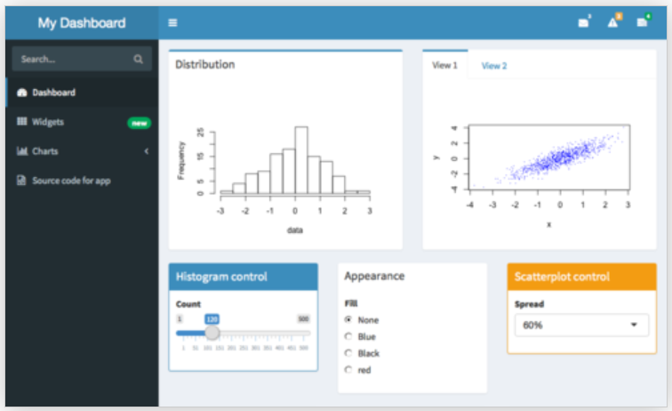

# Structurer sa page

## Structurer sa page | __sidebarLayout__ | Définition

Le template basique `sidebarLayout` divise la page en deux colonnes et doit contenir :

- `sidebarPanel`, à gauche, en général pour les inputs

- `mainPanel`, à droite, en général pour les outputs

```{r , echo = TRUE, eval = FALSE}
shinyUI(fluidPage(
  titlePanel("Old Faithful Geyser Data"), # title
  sidebarLayout(
    sidebarPanel("Eléments du sidebar (séparés par des virgules)"),
    mainPanel("Eléments du panel (séparés par des virgules)")
  )
))
```

## Structurer sa page | __sidebarLayout__ | Exemple

```{r, echo = FALSE}
shinyApp(
  ui = fluidPage(
    titlePanel("My first app"),
    sidebarLayout(
      sidebarPanel(
        "Eléments séparés par des virgules"
      ),
      mainPanel(
        "Eléments séparés par des virgules"
      )
    )
  ),
  server = function(input, output) {}
)
```

## Structurer sa page | __wellPanel__ | Définition

Comme avec le ``sidebarPanel`` précédent, on peut griser un ensemble d'éléments en utilisant un ``wellPanel`` :

```{r , echo = TRUE, eval = FALSE}
shinyUI(fluidPage(
  titlePanel("Old Faithful Geyser Data"), # title
  wellPanel(
    sliderInput("num", "Choose a number", value = 25, min = 1, max = 100),  
    textInput("title", value = "Histogram", label = "Write a title")
  ),
  plotOutput("hist")
))
```

## Structurer sa page | __wellPanel__ | Exemple

```{r, echo = FALSE}
shinyApp(
  ui = fluidPage(
    fluidRow(
      column(6,
        h2("Without wellPanel"), # title
        sliderInput("num", "Choose a number", value = 25, min = 1, max = 100),  
        textInput("title", value = "Histogram", label = "Write a title")
      ),
      column(6,
        h2("With wellPanel"), # title
        wellPanel(
          sliderInput("num", "Choose a number", value = 25, min = 1, max = 100),  
          textInput("title", value = "Histogram", label = "Write a title")
        )
      )
    )
  ),
  server = function(input, output) {}
)
```

## Structurer sa page | __navbarPage__ | Définition

Utiliser une barre de navigation et des onglets avec `navbarPage` et `tabPanel`:

```{r , echo = TRUE, eval = FALSE}
shinyUI(
  navbarPage(
    title = "My first app",
    tabPanel(title = "Summary",
             "Here is the summary"),
    tabPanel(title = "Plot",
             "some charts"),
    tabPanel(title = "Table",
             "some tables")
  )
)
```

## Structurer sa page | __navbarPage__ | Définition

Nous pouvons rajouter un second niveau de navigation avec un `navbarMenu` : 

```{r , echo = TRUE, eval = FALSE}
shinyUI(
  navbarPage(
    title = "My first app",
    tabPanel(title = "Summary",
             "Here is the summary"),
    tabPanel(title = "Plot",
             "some charts"),
    navbarMenu("Table",
      tabPanel("Table 1"),
      tabPanel("Table 2")
    )
  )
)
```

## Structurer sa page | __navbarPage__ | Shiny app

```{r, echo = FALSE}
shinyApp(
  ui = navbarPage(
    title = "My first app",
    tabPanel(title = "Summary",
             "Here is the summary"),
    tabPanel(title = "Plot",
             "some charts"),
    navbarMenu("Table",
      tabPanel("Table 1", "a table"),
      tabPanel("Table 2", "another table")
    )
  ),
  server = function(input, output) {}
)
```

## Structurer sa page | __tabsetPanel__ | Définition

Plus généralement, nous pouvons créer des onglets à n'importe quel endroit en utilisant `tabsetPanel` & `tabPanel`:

```{r , echo = TRUE, eval = FALSE}
shinyUI(fluidPage(
  titlePanel("Old Faithful Geyser Data"), # title
  sidebarLayout(
    sidebarPanel("SIDEBAR"),
    mainPanel(
      tabsetPanel(
        tabPanel("Plot", plotOutput("plot")), 
        tabPanel("Summary", verbatimTextOutput("summary")), 
        tabPanel("Table", tableOutput("table"))
      )
    )
  )
))
```

## Structurer sa page | __tabsetPanel__ | Exemple

```{r, echo = FALSE}
shinyApp(
  ui = fluidPage(
    titlePanel("My first app"),
    sidebarLayout(
      sidebarPanel(
        "SIDEBAR"
      ),
    mainPanel(
      tabsetPanel(
        tabPanel("Plot", "plot"), 
        tabPanel("Summary", "summary"), 
        tabPanel("Table", "table")
      )
    )
  )
  ),
  server = function(input, output) {}
)
```

## Structurer sa page | __navlistPanel__ | Définition

Une alternative au `tabsetPanel`, pour une disposition verticale plutôt qu'horizontale : ``navlistPanel``

```{r , echo = TRUE, eval = FALSE}
shinyUI(fluidPage(
      navlistPanel(
        tabPanel("Plot", plotOutput("plot")), 
        tabPanel("Summary", verbatimTextOutput("summary")), 
        tabPanel("Table", tableOutput("table"))
    )
))
```

## Structurer sa page | __navlistPanel__ | Exemple

```{r, echo = FALSE}
shinyApp(
  ui = fluidPage(
      navlistPanel(
        tabPanel("Plot", "plot"), 
        tabPanel("Summary", "summary"), 
        tabPanel("Table", "table")
      )
  ),
  server = function(input, output) {}
)
```

## Structurer sa page | __Grid Layout__ | Définition

Créer sa propre organisation avec `fluidRow()` et `column()`

* chaque ligne peut être divisée en 12 colonnes 
* le dimensionnement final de la page est automatique en fonction des éléments dans les lignes / colonnes

```{r , echo = TRUE, eval = FALSE}

tabPanel(title = "Summary",
         # A fluid row can contain from 0 to 12 columns
         fluidRow(
           # A column is defined necessarily
           # with its argument "width"
           column(width = 4, "Eléments de la 1ère colonne"),
           column(width = 4, "Eléments de la 2nd colonne"),
           column(width = 4, "Eléments de la 3ième colonne"),
         ))
```

## Structurer sa page | __Grid Layout__ | Shiny app

```{r , echo = FALSE}
shinyApp(
  ui = navbarPage(
    title = "My first app",
    tabPanel(
      title = "Summary",
      fluidRow(
        column(
          width = 4,
          "column 1", 
          "With a plot",
          "And a Table"
        ),
        column(
          width = 4,
          "column 2"
        ),
        column(
          width = 4,
          "column 3"
        )
      )
    ),
    tabPanel(title = "Plot",
             "some charts"),
    tabPanel(title = "Table",
             "some tables")
  ),
  server = function(input, output) {}
)
```


## Structurer sa page | __shinydashboard__

Le package [shinydashboard](https://rstudio.github.io/shinydashboard/) propose d'autres fonctions pour créer des tableaux de bords :

<div style="text-align:center" markdown="1">

</div>

<https://rstudio.github.io/shinydashboard/>

## Structurer sa page | __Combiner les structures__ | Shiny app

Toutes les structures peuvent s'utiliser en même temps !

```{r , echo = FALSE}
shinyApp(
  ui = navbarPage(
    title = "Combiner les structures",
    tabPanel(
      title = "fluidRow",
      fluidRow(
        column(
          width = 6,
          HTML("<h4> Header created with HTML() </h4>")
        ),
        column(
          width = 6,
          tags$div(style = "color:blue",
                   align = "center",
                   "Simple div created with tags$div()")
        )
      )
    ),
    tabPanel(
      title = "navlistPanel & tabSetPanel",
      navlistPanel(
        tabPanel("Plot",
              tabsetPanel(
                tabPanel("Individus", plotOutput("plot")), 
                tabPanel("Variables", tableOutput("table"))
          )), 
        tabPanel("Summary", verbatimTextOutput("summary")), 
        tabPanel("Table", tableOutput("table"))
    )
    )
  ),
  server = function(input, output) {}
)
```
